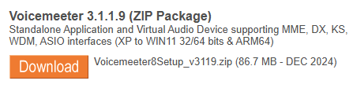
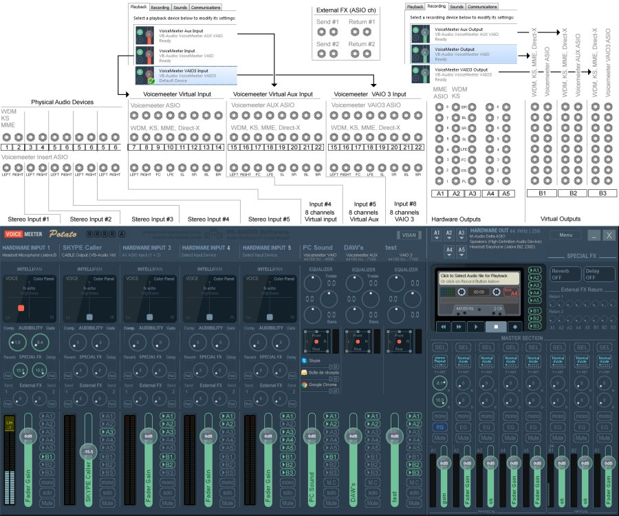
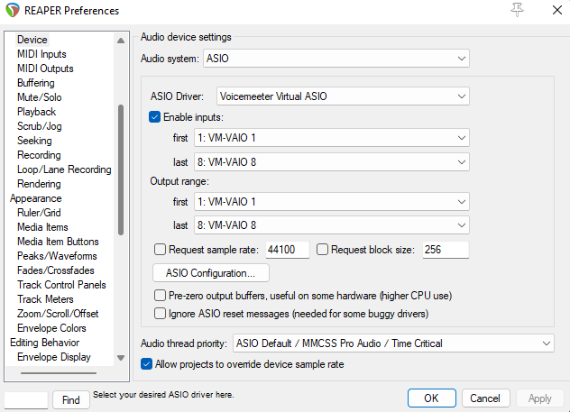

# Guide to Routing Audio for Musicians

[ **Українською**](./README.ua.md)

## Introduction

This document provides instructions for routing audio devices on a Windows PC. It's intended for musicians who need to connect a guitar and microphone through effects software to monitor speakers and video chat applications, which is useful for online lessons, recording, and live streaming.

## Table of contents
- [Guide to Routing Audio for Musicians](#guide-to-routing-audio-for-musicians)
  - [Introduction](#introduction)
  - [Table of contents](#table-of-contents)
  - [Prerequisites](#prerequisites)
  - [Hardware Audio Interface](#hardware-audio-interface)
    - [The Role of a Hardware Audio Interface](#the-role-of-a-hardware-audio-interface)
    - [There are a few common types of hardware audio interfaces:](#there-are-a-few-common-types-of-hardware-audio-interfaces)
    - [Audio Interface Input/Output Architecture](#audio-interface-inputoutput-architecture)
  - [Voicemeeter software](#voicemeeter-software)
    - [Setting Up **`Voicemeeter Potato`**](#setting-up-voicemeeter-potato)
    - [Let's launch it](#lets-launch-it)
    - [Voicemeeter App Interface Sections](#voicemeeter-app-interface-sections)
    - [Understanding Virtual Inputs and System Channels](#understanding-virtual-inputs-and-system-channels)
    - [Understanding Virtual Outputs and System Buses](#understanding-virtual-outputs-and-system-buses)
      - [A Buses (Hardware Outs)](#a-buses-hardware-outs)
      - [B Buses (Virtual Outs)](#b-buses-virtual-outs)
    - [The general purpose schema of **`Voicemeeter Potato`** I/O](#the-general-purpose-schema-of-voicemeeter-potato-io)
    - [Essential Windows System Settings](#essential-windows-system-settings)
      - [Set your Output Device (Playback):](#set-your-output-device-playback)
      - [Set your Input Device (Recording):](#set-your-input-device-recording)
    - [Setting up Your Default Input/Output](#setting-up-your-default-inputoutput)
      - [Setting Up Your Default Hardware Output](#setting-up-your-default-hardware-output)
      - [Setting Up Your Hardware Inputs](#setting-up-your-hardware-inputs)
    - [Simple direct routing](#simple-direct-routing)
    - [Optimizing Buffering and Sample Rate](#optimizing-buffering-and-sample-rate)
    - [Here we go! Verifying Your Basic Setup](#here-we-go-verifying-your-basic-setup)
  - [Configuring Your Video Chat App](#configuring-your-video-chat-app)
  - [Advanced Routing Schemas](#advanced-routing-schemas)
    - [Understanding the **`Voicemeeter Virtual Input ASIO`** driver](#understanding-the-voicemeeter-virtual-input-asio-driver)
    - [Routing through a `DAW` / `VSTs`](#routing-through-a-daw--vsts)
      - [Why We Use It?](#why-we-use-it)
      - [Enabling **`Voicemeeter Virtual Input ASIO`**](#enabling-voicemeeter-virtual-input-asio)
      - [Enabling Voicemeeter Virtual Insert Return](#enabling-voicemeeter-virtual-insert-return)
    - [Low-end interfaces routing schema](#low-end-interfaces-routing-schema)
      - [Routing Overview](#routing-overview)
      - [Hardware Input](#hardware-input)
      - [Processing with `DAW` / `VSTs`](#processing-with-daw--vsts)
      - [Return Path](#return-path)
      - [Final Mix and Output](#final-mix-and-output)
    - [Hi-end interfaces routing schema](#hi-end-interfaces-routing-schema)
    - [Multiple audio interfaces schema](#multiple-audio-interfaces-schema)

## Prerequisites

* [**Hardware Audio Interface**](#hardware-audio-interface) 
  
  A hardware device like a USB or PCI-E sound card, or a guitar processor with a USB audio driver.

* **Microphone**

* **Guitar**

* [**`Voicemeeter Potato`**](#voicemeeter-software) 
  
  This software routes your audio hardware and virtual I/O devices. Be sure to use the Potato version, as it includes its own **`Voicemeeter Virtual Input ASIO`** driver. This driver is crucial for routing sound through a `DAW` or software like `Guitar Rig` or `Bias FX`.

* **`DAW` / `VSTs`** 
  
  A `DAW` (Digital Audio Workstation) is used to manage your hardware inputs and add effects to your audio channels via the **`Voicemeeter Virtual Input ASIO`** driver. Depending on your setup, you may be able to use `VST` plugins directly without a full `DAW`.

* **Video chat application** 
  
  Any app that allows you to select an audio device, such as Google Meet, Zoom, Telegram, or Discord.

## Hardware Audio Interface

### The Role of a Hardware Audio Interface

A hardware audio interface is an essential external device for any serious audio setup. It features its own dedicated **`Central Audio Processor (CAP)`**, which handles audio processing independently of your computer's built-in sound card.

The primary function of an interface is to provide high-quality physical connections for professional-grade microphones and instruments. It includes various input/output options, such as XLR ports for microphones, and 1/4" (6.5mm) or 1/8" (3.5mm) jacks for instruments like guitars and synthesizers.

These interfaces connect to your PC via USB or PCI-E, and their dedicated processing power is key to **`reducing audio input/output latency`**. This is a critical advantage for musicians, as it allows for real-time monitoring and recording with minimal delay.

### There are a few common types of hardware audio interfaces:

* **USB Audio Card / Guitar Processor with USB Interface:** These are external devices that connect to your computer via a USB cable.

* **On-Motherboard Audio Card:** This is an integrated sound card built directly into your computer's motherboard.

* **PCI-E Audio Card:** A sound card that is installed internally into a PCI-E slot on your motherboard.

* **Hardware Synth's Built-in USB Audio Interface:** Many modern synthesizers include a built-in audio interface, allowing you to connect them directly to your computer via `USB`.

### Audio Interface Input/Output Architecture

> [!IMPORTANT]
> This section is essential for understanding the core principles of audio routing. A thorough understanding will ensure a successful setup.

The number of available hardware and software inputs and outputs on an audio interface depends on its `Central Audio Processor (CAP)`.

* **`Simpler interfaces`** typically feature a CAP that assigns a single stereo channel (R/L) to two mono hardware inputs. Consequently, the interface is displayed in your operating system as one stereo device with two channels (R and L). While functional, this can complicate the routing and setup process, particularly on a Windows system.

* **`Higher-end interfaces`** employ a more advanced CAP design where each hardware input is assigned its own dedicated stereo channel. This allows the system to recognize each hardware input as a separate, distinct interface, providing greater flexibility and simplified routing.

The provided diagram illustrates this difference.

## Voicemeeter software

`Voicemeeter` is a free virtual audio mixer for `Windows`. It allows you to manage and route audio from various sources—both hardware (like a microphone or an audio interface) and software (like a web browser, video game, or video chat app).

Essentially, it acts as a central hub where you can mix all your computer's sounds, apply effects, and then send the final mix to multiple outputs, such as your headphones, speakers, or a recording application. It's a powerful tool for musicians, podcasters, and streamers who need more control over their audio than a standard Windows setup provides.

### Setting Up **`Voicemeeter Potato`**

> [!Important]
> It is crucial that you download and install the **`Voicemeeter Potato`** version. Unlike the standard Voicemeeter, the Potato version includes the essential **`Voicemeeter Virtual Input ASIO`** driver. This driver is required for routing audio through your `DAW` or `VST` plugins (like Guitar Rig or Bias FX), which is a key part of this guide's setup.

* **Download **`Voicemeeter Potato`****
  
  [Navigate to the official website](https://vb-audio.com/Voicemeeter/potato.htm) and click the prominent orange **"Download"** button.

* **Install the Software**
  
  Once the download is complete, run the installer. **Click "Install"** and wait for the process to finish, it can take few minutes

  
  

* **Restart Your PC**
  
  A system reboot is required to finalize the installation and enable all virtual audio drivers. Please restart your computer before proceeding.

### Let's launch it

Open **`Start`** and run **`Voicemeeter Potato x64`**

### Voicemeeter App Interface Sections

The **`Voicemeeter Potato`** app have the interface separated to the few general sections
* Hardware inputs
* Software Virtual Inputs
* Hardware Outputs Selector
* Master Section
  * Hardware Outputs
  * Software Virtual Outputs

### Understanding Virtual Inputs and System Channels

In **`Voicemeeter Potato`**, the virtual devices you select in Windows for playback correspond directly to the mixer's input channels. This is how you route sound from software applications into Voicemeeter.

* **Hardware Inputs (Physical Devices)**
  These channels are designed to receive audio from your external hardware connected to your PC (e.g., your audio interface, USB mic, etc.).

* **Hardware Input 1-5**
  
  You assign these channels to a physical device in the **`Select Input Device`** menu. For example, you would select your audio interface here to bring in your guitar and mic signals.

* **Virtual Inputs (Software Applications)** 
  
  These channels are designed to receive audio directly from software on your computer.

* **Voicemeeter VAIO**
  
  This is the primary virtual input channel. You can set this as the default playback device in your Windows sound settings. Any application that uses the default playback device (like a web browser or media player) will have its audio routed to this channel.

* **Voicemeeter AUX VAIO**
  
  This is a secondary virtual input. You can assign specific applications to use this channel, allowing you to control their audio levels independently within the Voicemeeter mixer.

* **Voicemeeter VAIO3**
   
  A third virtual input in the Potato version, offering even more flexibility for routing audio from a third application.

> [!Note]
> Each of these virtual inputs appears as a separate playback device in your Windows sound settings. By choosing which program uses which virtual input, you can mix and control all your computer's audio sources from one central place.

### Understanding Virtual Outputs and System Buses

In **`Voicemeeter Potato`**, the virtual devices you see in Windows correspond directly to the mixer's output buses. This is the core principle of audio routing.

#### A Buses (Hardware Outs)
These are designed to send your audio to physical devices connected to your computer.

* **A1** - This is the main hardware bus. You can assign it to your headphones or studio monitors, for example.
* **A2** - The second hardware bus, which you can use for additional monitors or other equipment.
* ...and so on, up to **A5**.

#### B Buses (Virtual Outs)
These are designed to send your mixed audio signal back into the system for other applications (video chats, recording software, etc.) to use.

* **B1** - The primary virtual bus. This channel is typically used as the "virtual microphone" in apps like Discord, Zoom, and OBS. Everything you send to the `B1` bus will be heard in those applications.
* **B2** - The second virtual bus, which can be used for an additional audio stream, such as a separate track for recording software or a dedicated stream for a specific application.
* **B3** - The third virtual bus.

> [!Note]
> Every channel in your Voicemeeter mixer has buttons for `A1-A5` and `B1-B3`. By clicking these, you decide where to route the audio from that specific channel. For example, if you enable `A1` on your guitar channel, you'll hear it in your headphones. If you enable `B1`, it will be heard in your video chat.

### The general purpose schema of **`Voicemeeter Potato`** I/O

### Essential Windows System Settings

#### Set your Output Device (Playback):

* Go to your Windows Sound Settings.
* Under the "Output" section, select `Voicemeeter Input` as your main or default device.

  

Why? This tells your system to send all audio from your web browser, games, system notifications, and other applications directly to Voicemeeter. This audio stream will appear on the `Voicemeeter Input` virtual input in your mixer.

#### Set your Input Device (Recording):

* In the same Windows Sound Settings window, go to the "Input" section.
* Select Voicemeeter Output as your main or default device.

  

Why? This device corresponds to the main virtual bus, `B1`, in `Voicemeeter`. When you choose this as your microphone in a video chat app like Discord or Zoom, that application will receive the entire audio mix you send to the `B1` bus—which could be your microphone, your guitar, and any other sounds you've routed there.

### Setting up Your Default Input/Output

#### Setting Up Your Default Hardware Output
Now that you've routed all your system audio into Voicemeeter, you need to route it back out to your physical speakers or headphones so you can hear it.

* **Select a Hardware Output**
    
  In the top right section of the Voicemeeter interface, you'll see a panel labeled "Hardware Out". Click on the button for `A1`.

  

* **Choose Your Device**
  
  From the dropdown menu that appears, select your preferred listening device. This is typically your headphones, studio monitors, or a physical output on your audio interface (e.g., your Behringer, Scarlett 2i2 or similar).

  

By completing this step, any audio you send to the `A1` bus in Voicemeeter will be routed to your selected hardware device, allowing you to hear your instruments, microphone, and other system sounds.

#### Setting Up Your Hardware Inputs
Voicemeeter can accept audio from up to five separate hardware devices. This is where you connect your audio interface, USB mic, or any other physical input device.

* **Locate the Hardware Input Strips**
  On the far left of the Voicemeeter interface, you'll see a series of vertical channel strips labeled Stereo Input 1, Stereo Input 2, and so on.

* **Select Your First Device**
  Click the button labeled **`Select Input Device`** at the top of the first channel strip you want to use.
  
  

* **Choose Your Audio Interface** 
  From the dropdown menu, select your audio interface. It's best to choose the ASIO driver for your device if available, as it provides the lowest latency.

  

* **Add More Devices** 
  
  If you have multiple devices—for example, a separate USB microphone or a MIDI controller with audio input—repeat the process for the other Hardware Input strips.

By doing this, you're telling Voicemeeter to listen to your physical devices. You can now use the faders and buttons on these channels to mix and route the audio from your guitar and microphone to the output buses.

### Simple direct routing

Once your inputs and outputs are selected, routing audio is done with just a few clicks. The goal is to send your sounds to the correct output buses: `A1` (so you can hear them) and `B1` (so your audience can hear them).

The simple routing schema which, explanation you can find below.

* **For your Microphone and Guitar**
  * Locate the channels corresponding to your microphone and guitar in the Hardware Input section.
  * For each channel, click the `A1` button. This sends your sound to the `A1` output, allowing you to monitor yourself through your headphones.
  * Next, click the `B1` button on each channel. This sends your sound to the `B1` output, which will be picked up by your video chat application.

* **For System Sounds**
  * Find the Voicemeeter VAIO channel in the Virtual Inputs section.
  * Click the `A1` button. This sends all your system sounds (browser audio, game sounds, etc.) to your headphones, so you can hear them.
  * If you want others in your video chat to hear your system sounds, you can also click the `B1` button on this channel.

* **Final Check**
  * Make sure you can see a signal on the fader for your microphone and guitar.
  * Confirm that the `A1` and `B1` buttons are lit up on the channels you want to route.
  * This simple setup routes all essential audio sources to both you (via `A1`) and your audience (via `B1`), creating a complete and balanced mix.

### Optimizing Buffering and Sample Rate
> [!Important]
> Properly setting the buffer size is crucial for minimizing latency between your instrument and your speakers.

* Open the **`Voicemeeter Potato`** application and click the **`Menu`** button in the top right corner.
* From the dropdown menu, select `System Settings` option.
* In the settings window, locate the `Buffering` section and set the buffer size to `256` for both driver types: 
  * `WDM (Wave Device)`: The standard Windows driver.
  * `ASIO`: The low-latency driver used for professional audio.

> [!NOTE]
> You can experiment with lowering the buffer size to `160` or even less if needed. However, very low buffering can cause audio artifacts (crackling, dropouts) if your CPU cannot process the audio fast enough. The optimal value depends on your computer's performance.

### Here we go! Verifying Your Basic Setup

You're all set! At this point, your core setup should be complete. You can now test your audio to confirm that everything is working as expected.

* You should be able to hear the following through your headphones or monitors:
* All system sounds (from your browser, video chat app, games, etc.)
* Your microphone
* Your guitar
* You should also be able to use Voicemeeter Output as your microphone in other applications (like Discord or Zoom).

> [!Tip]
> If you don't require advanced audio routing through a `DAW` or `VSTs` plugins, your setup is now complete.
You can to go to the [Configuring your video chat app](#configuring-your-video-chat-app) section.

## Configuring Your Video Chat App

* Open your video chat application (e.g., Discord, Zoom, Google Meet).
* Go to the Audio Settings or Voice & Video section.
* For the `Microphone` or Input Device setting, select `Voicemeeter Out B1`.
* For the `Speakers` or Output Device setting, select `Voicemeeter Input`. 

## Advanced Routing Schemas

### Understanding the **`Voicemeeter Virtual Input ASIO`** driver

The Voicemeeter Virtual Input ASIO driver is a key feature of the **`Voicemeeter Potato`** version. It creates a dedicated, low-latency audio connection between your Voicemeeter mixer and other professional audio software.

**What it is**
  
A specialized virtual input that functions using the ASIO protocol. Unlike standard WDM drivers, ASIO is designed for professional audio applications and minimizes the delay (latency) between the moment a sound is created and the moment it is processed.

**What it's for**

This driver is essential for integrating a Digital Audio Workstation (`DAW`) or standalone `VST` plugins (like Guitar Rig or Bias FX) into your Voicemeeter setup. By selecting this driver within your `DAW`, you can send your audio (e.g., your guitar signal) through effects software and then back into Voicemeeter, all with minimal latency.

In short, it's the bridge that allows you to use your favorite effects software and professional audio tools in real-time within your Voicemeeter workflow.

### Routing through a `DAW` / `VSTs`

#### Why We Use It?

Routing your audio through a Digital Audio Workstation (`DAW`) or a `VST` host is the key to achieving professional-quality sound for your instrument. This process allows you to add powerful effects like distortion, cabinet emulation, reverb, and EQ to your guitar or microphone in real time. This is what makes a simple home setup sound like a professional studio, which is perfect for online lessons, streaming, and recording.

#### Enabling **`Voicemeeter Virtual Input ASIO`**
To send your audio into a `DAW` or `VST` host, you need to use the specialized **`Voicemeeter Virtual Input ASIO`** driver. This driver provides the low-latency connection required for real-time processing.

* Open your `DAW` (e.g., `Ableton`, `FL Studio`) or your `VST` host application (e.g., Guitar Rig, Bias FX).
* Go to the Audio Settings or Preferences menu.
* Under the Input Device or Driver settings, select **`Voicemeeter Virtual Input ASIO`**. This tells your software to receive its audio from Voicemeeter.
* Within your software, ensure that your instrument channel's input is set to receive audio from the Left or Right channel of the **`Voicemeeter Virtual Input ASIO`** driver.

  There is examples of some `DAW` settings:

  **FL Studio Audio Settings**

  

  **Reaper Device Preferences**

  

#### Enabling Voicemeeter Virtual Insert Return
Once your audio is processed with effects in the `DAW` or `VST` host, you need to send it back to Voicemeeter for the final mix.

* In your `DAW` or `VST` host, go back to the Audio Settings.

* Set the Output Device or Driver to `Voicemeeter VAIO` or another virtual input you wish to use.

Your processed audio will now appear on the corresponding Virtual Input channel in your Voicemeeter mixer. You can now mix this new, processed signal with your other audio sources and route it to your headphones `(A1)` and video chat `(B1)`.

### Low-end interfaces routing schema
This diagram illustrates a detailed audio routing setup for low-end audio interfaces that combine two physical mono inputs (e.g., a microphone and a guitar) into a single stereo channel. This configuration is essential for musicians who need to process their instruments with effects in real-time.

#### Routing Overview

#### Hardware Input
The audio from your microphone and guitar is captured by the interface and sent to your PC as a single stereo input. This input is then assigned to a Hardware Input channel in Voicemeeter.

#### Processing with `DAW` / `VSTs`
To add effects, the audio is routed from Voicemeeter to a `DAW` or `VST` host (like Guitar Rig). This is a crucial step that uses the Voicemeeter Virtual Input ASIO driver to ensure a low-latency connection.

#### Return Path
The processed audio, now complete with effects (e.g., distortion, reverb), is sent back from the `DAW` / `VST` to a Virtual Input channel in Voicemeeter.

#### Final Mix and Output
Once the processed audio is back in Voicemeeter, it is routed to two main output buses:

* **A1 (Hardware Out):** This bus sends the final mix to your physical headphones or monitors, allowing you to hear yourself and all system sounds.

* **B1 (Virtual Out):** This bus sends the final mix to your video chat application (Google Meet, Zoom, etc.), allowing your audience to hear your processed sound.

This complete schema shows how to bypass the limitations of a simple audio interface to achieve professional-grade, low-latency audio processing for online lessons, streaming, and recording.

### Hi-end interfaces routing schema

Refactoring...

<!-- #### Routing Overview
The diagram illustrates a comprehensive audio signal flow, starting from hardware inputs, routing through a Digital Audio Workstation (`DAW`) and Virtual Studio Technology (`VST`) plugins for processing, and finally outputting to headphones, monitors or video chat/streaming app. The key feature is the use of two separate stereo hardware inputs, allowing for simultaneous recording of multiple stereo sources like synthesizers, microphones, etc., and then processing them independently within the `DAW`.

#### Hardware Input
The setup begins with two separate stereo inputs into an audio interface, such as the Focusrite Scarlett 4i4. The diagram labels these as "Hardware Stereo Input 1 (L/R)" and "Hardware Stereo Input 2 (L/R)."

* **Input 1:** A stereo signal from a source like a hardware synthesizer, guitar, microphone is connected to this input pair.
* **Input 2:** Another stereo source, perhaps a drum machine or a second synthesizer, is connected here.
The audio interface sends these two distinct stereo signals to the `DAW`, where they are received on two separate stereo channels, labeled "Hardware Input 1" and "Hardware Input 2."

#### Processing with `DAW` / `VSTs`
Once inside the `DAW`, the signals are processed independently. The diagram shows the signal from each hardware input being sent to a dedicated mixer channel within the `DAW`.

* **Mixer Channel 1:** The signal from Hardware Input 1 is routed here. It's then processed with a chain of `VST` plugins, including EQ, compressor, and reverb. The diagram also shows a `Voicemeeter` plugin, suggesting vocal-specific processing, which could be an emulation or a different type of channel strip. The processed audio is then sent back to a "Voicemeeter In#3 Left/Right."

* **Mixer Channel 2:** The signal from Hardware Input 2 is routed here and processed with a different set of VST plugins, including EQ, compressor, and a "Cabinet simulation," indicating that this channel is likely for a guitar or bass signal. This processed audio is also sent to a "Voicemeeter In#4 Left/Right."

The use of two separate channels and independent plugin chains allows for granular control and specific sound design for each source. The diagram also shows the output of the `DAW` being routed to a Google Meet/Zoom call, indicating this setup can be used for streaming or online collaboration.

#### Return Path
The processed audio from the `DAW` needs to be sent back to the user to be heard. This is where the return path comes in. The "Final Mix" from the DAW's mixer channels is sent back to the Voicemeeter Hardware Inputs (In#3 and In#4)
Master channel output can be optionally sent back to the Voicemeeter Hardware Input (In#5). 

#### Final Mix and Output
The final mix, now with all the processing applied, is sent from the `DAW` to the audio interface. The audio interface then routes this signal to the final listening devices:

* **Headphones:** The processed audio is sent to the headphone jack on the audio interface.

* **Monitors:** The signal is also sent to studio monitors for a wider listening perspective.
This configuration is ideal for low-latency monitoring, as the processed audio is routed directly back to the headphones and monitors from the audio interface, bypassing any software-level monitoring that could introduce delay. This is a common setup for professional music production and live streaming where minimal latency is critical.

This complete schema shows how to setup Voicemeeter and `DAW` to achieve professional-grade, low-latency audio processing for online lessons, streaming, and recording. -->

### Multiple audio interfaces schema
Soon...