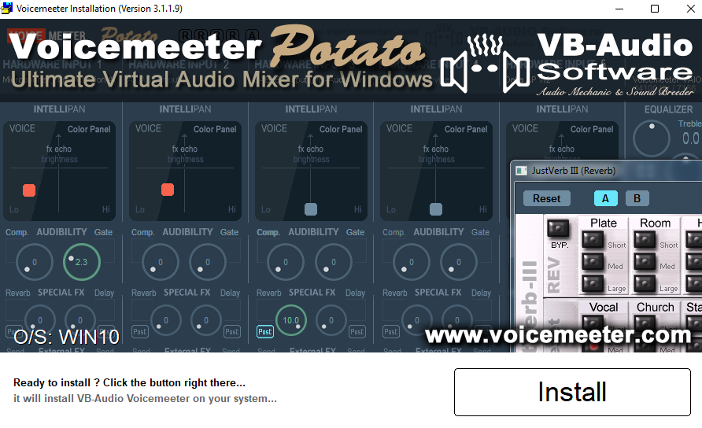
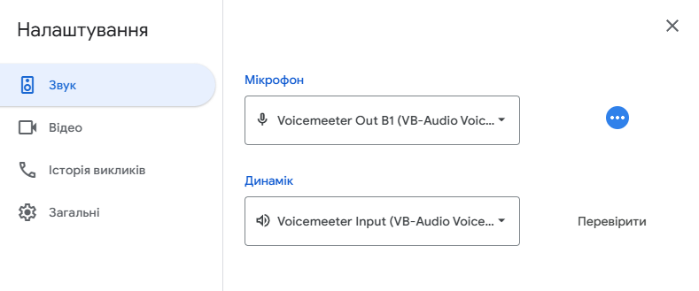

# Guide to Routing Audio for Musicians

## Introduction

This document provides instructions for routing audio devices on a Windows PC. It's intended for musicians who need to connect a guitar and microphone through effects software to monitor speakers and video chat applications, which is useful for online lessons, recording, and live streaming.

## Table of contents
- [Guide to Routing Audio for Musicians](#guide-to-routing-audio-for-musicians)
  - [Introduction](#introduction)
  - [Table of contents](#table-of-contents)
  - [Prerequisites](#prerequisites)
  - [Hardware Audio Interface](#hardware-audio-interface)
    - [The Role of a Hardware Audio Interface](#the-role-of-a-hardware-audio-interface)
    - [There are a few common types of hardware audio interfaces:](#there-are-a-few-common-types-of-hardware-audio-interfaces)
    - [Audio Interface Input/Output Architecture](#audio-interface-inputoutput-architecture)
  - [Voicemeeter software](#voicemeeter-software)
    - [Setting Up Voicemeeter Potato](#setting-up-voicemeeter-potato)
      - [Download Voicemeeter Potato: Navigate to the official website and click the prominent orange **"Download"** button.](#download-voicemeeter-potato-navigate-to-the-official-website-and-click-the-prominent-orange-download-button)
      - [Install the Software](#install-the-software)
      - [Restart Your PC](#restart-your-pc)
    - [Let's start now](#lets-start-now)
      - [Voicemeeter App Interface Sections](#voicemeeter-app-interface-sections)
      - [Understanding Virtual Inputs and System Channels](#understanding-virtual-inputs-and-system-channels)
        - [Hardware Inputs (Physical Devices)](#hardware-inputs-physical-devices)
        - [Hardware Input 1-5](#hardware-input-1-5)
        - [Virtual Inputs (Software Applications):](#virtual-inputs-software-applications)
        - [Voicemeeter VAIO](#voicemeeter-vaio)
        - [Voicemeeter AUX VAIO](#voicemeeter-aux-vaio)
        - [Voicemeeter VAIO3](#voicemeeter-vaio3)
      - [Understanding Virtual Outputs and System Buses](#understanding-virtual-outputs-and-system-buses)
        - [A Buses (Hardware Outs)](#a-buses-hardware-outs)
        - [B Buses (Virtual Outs)](#b-buses-virtual-outs)
      - [The general purpose schema of Voicemeeter Potato I/O](#the-general-purpose-schema-of-voicemeeter-potato-io)
      - [Essential Windows System Settings](#essential-windows-system-settings)
        - [Set your Output Device (Playback):](#set-your-output-device-playback)
        - [Set your Input Device (Recording):](#set-your-input-device-recording)
      - [Setting Up Your Default Hardware Output (A1)](#setting-up-your-default-hardware-output-a1)
      - [Setting Up Your Hardware Inputs](#setting-up-your-hardware-inputs)
      - [Simple direct routing](#simple-direct-routing)
      - [Optimizing Buffering and Sample Rate](#optimizing-buffering-and-sample-rate)
      - [Here we go!](#here-we-go)
      - [Route through DAW / VSTs](#route-through-daw--vsts)
  - [Configuring Your Video Chat App](#configuring-your-video-chat-app)
  - [Advanced Routing Schemas](#advanced-routing-schemas)
    - [Low-end interfaces routing schema](#low-end-interfaces-routing-schema)
    - [Hi-end interfaces routing schema](#hi-end-interfaces-routing-schema)
    - [Multiple audio interfaces schema](#multiple-audio-interfaces-schema)

## Prerequisites

* [**Hardware Audio Interface:**](#hardware-audio-interface) A hardware device like a USB or PCI-E sound card, or a guitar processor with a USB audio driver.
* **Microphone**
* **Guitar**
* [**Voicemeeter Potato:**](#voicemeeter-software) This software routes your audio hardware and virtual I/O devices. Be sure to use the Potato version, as it includes its own `Voicemeeter Virtual Input ASIO` driver. This driver is crucial for routing sound through a `DAW` or software like `Guitar Rig` or `Bias FX`.
* **DAW / VSTs:** A `DAW` (Digital Audio Workstation) is used to manage your hardware inputs and add effects to your audio channels via the `Voicemeeter Virtual Input ASIO` driver. Depending on your setup, you may be able to use `VST` plugins directly without a full `DAW`.
* **Video chat application:** Any app that allows you to select an audio device, such as Google Meet, Zoom, Telegram, or Discord.

## Hardware Audio Interface

### The Role of a Hardware Audio Interface

A hardware audio interface is an essential external device for any serious audio setup. It features its own dedicated **`Central Audio Processor (CAP)`**, which handles audio processing independently of your computer's built-in sound card.

The primary function of an interface is to provide high-quality physical connections for professional-grade microphones and instruments. It includes various input/output options, such as XLR ports for microphones, and 1/4" (6.5mm) or 1/8" (3.5mm) jacks for instruments like guitars and synthesizers.

These interfaces connect to your PC via USB or PCI-E, and their dedicated processing power is key to **`reducing audio input/output latency`**. This is a critical advantage for musicians, as it allows for real-time monitoring and recording with minimal delay.

### There are a few common types of hardware audio interfaces:

* **USB Audio Card / Guitar Processor with USB Interface:** These are external devices that connect to your computer via a USB cable.

* **On-Motherboard Audio Card:** This is an integrated sound card built directly into your computer's motherboard.

* **PCI-E Audio Card:** A sound card that is installed internally into a PCI-E slot on your motherboard.

* **Hardware Synth's Built-in USB Audio Interface:** Many modern synthesizers include a built-in audio interface, allowing you to connect them directly to your computer via `USB`.

### Audio Interface Input/Output Architecture

> [!IMPORTANT]
> This section is essential for understanding the core principles of audio routing. A thorough understanding will ensure a successful setup.

The number of available hardware and software inputs and outputs on an audio interface depends on its Central Audio Processor (CAP).

* `Simpler interfaces` typically feature a CAP that assigns a single stereo channel (R/L) to two mono hardware inputs. Consequently, the interface is displayed in your operating system as one stereo device with two channels (R and L). While functional, this can complicate the routing and setup process, particularly on a Windows system.

* `Higher-end interfaces` employ a more advanced CAP design where each hardware input is assigned its own dedicated stereo channel. This allows the system to recognize each hardware input as a separate, distinct interface, providing greater flexibility and simplified routing.

The provided diagram illustrates this difference.

## Voicemeeter software

`Voicemeeter` is a free virtual audio mixer for `Windows`. It allows you to manage and route audio from various sources—both hardware (like a microphone or an audio interface) and software (like a web browser, video game, or video chat app).

Essentially, it acts as a central hub where you can mix all your computer's sounds, apply effects, and then send the final mix to multiple outputs, such as your headphones, speakers, or a recording application. It's a powerful tool for musicians, podcasters, and streamers who need more control over their audio than a standard Windows setup provides.

### Setting Up Voicemeeter Potato

> [!Important]
> It is crucial that you download and install the **`Voicemeeter Potato`** version. Unlike the standard Voicemeeter, the Potato version includes the essential **`Voicemeeter Virtual Input ASIO`** driver. This driver is required for routing audio through your `DAW` or `VST` plugins (like Guitar Rig or Bias FX), which is a key part of this guide's setup.

#### Download Voicemeeter Potato: [Navigate to the official website](https://vb-audio.com/Voicemeeter/potato.htm) and click the prominent orange **"Download"** button.

#### Install the Software
Once the download is complete, run the installer. **Click "Install"** and wait for the process to finish, it can take few minutes

#### Restart Your PC
A system reboot is required to finalize the installation and enable all virtual audio drivers. Please restart your computer before proceeding.

### Let's start now

Open `Start` and run **`Voicemeeter Potato x64`**

#### Voicemeeter App Interface Sections

The **`Voicemeeter Potato`** app have the interface separated to the few general sections
* Hardware inputs
* Software Virtual Inputs
* Hardware Outputs Selector
* Master Section
  * Hardware Outputs
  * Software Virtual Outputs

#### Understanding Virtual Inputs and System Channels

In Voicemeeter Potato, the virtual devices you select in Windows for playback correspond directly to the mixer's input channels. This is how you route sound from software applications into Voicemeeter.

##### Hardware Inputs (Physical Devices)
These channels are designed to receive audio from your external hardware connected to your PC (e.g., your audio interface, USB mic, etc.).

##### Hardware Input 1-5
You assign these channels to a physical device in the "Select Input Device" menu. For example, you would select your audio interface here to bring in your guitar and mic signals.

##### Virtual Inputs (Software Applications): 
These channels are designed to receive audio directly from software on your computer.

##### Voicemeeter VAIO
This is the primary virtual input channel. You can set this as the default playback device in your Windows sound settings. Any application that uses the default playback device (like a web browser or media player) will have its audio routed to this channel.

##### Voicemeeter AUX VAIO
This is a secondary virtual input. You can assign specific applications to use this channel, allowing you to control their audio levels independently within the Voicemeeter mixer.

##### Voicemeeter VAIO3 
A third virtual input in the Potato version, offering even more flexibility for routing audio from a third application.

> [!Note]
> Each of these virtual inputs appears as a separate playback device in your Windows sound settings. By choosing which program uses which virtual input, you can mix and control all your computer's audio sources from one central place.

#### Understanding Virtual Outputs and System Buses

In Voicemeeter Potato, the virtual devices you see in Windows correspond directly to the mixer's output buses. This is the core principle of audio routing.

##### A Buses (Hardware Outs)
These are designed to send your audio to physical devices connected to your computer.

* **A1** - This is the main hardware bus. You can assign it to your headphones or studio monitors, for example.
* **A2** - The second hardware bus, which you can use for additional monitors or other equipment.
* ...and so on, up to A5.

##### B Buses (Virtual Outs)
These are designed to send your mixed audio signal back into the system for other applications (video chats, recording software, etc.) to use.

* **B1** - The primary virtual bus. This channel is typically used as the "virtual microphone" in apps like Discord, Zoom, and OBS. Everything you send to the B1 bus will be heard in those applications.
* **B2** - The second virtual bus, which can be used for an additional audio stream, such as a separate track for recording software or a dedicated stream for a specific application.
* **B3** - The third virtual bus.

> [!Note]
> Every channel in your Voicemeeter mixer has buttons for A1-A5 and B1-B3. By clicking these, you decide where to route the audio from that specific channel. For example, if you enable A1 on your guitar channel, you'll hear it in your headphones. If you enable B1, it will be heard in your video chat.

#### The general purpose schema of Voicemeeter Potato I/O

#### Essential Windows System Settings

##### Set your Output Device (Playback):

* Go to your Windows Sound Settings.
* Under the "Output" section, select `Voicemeeter Input` as your main or default device.

    

Why? This tells your system to send all audio from your web browser, games, system notifications, and other applications directly to Voicemeeter. This audio stream will appear on the `Voicemeeter Input` virtual input in your mixer.

##### Set your Input Device (Recording):

* In the same Windows Sound Settings window, go to the "Input" section.
* Select Voicemeeter Output as your main or default device.

    

Why? This device corresponds to the main virtual bus, `B1`, in `Voicemeeter`. When you choose this as your microphone in a video chat app like Discord or Zoom, that application will receive the entire audio mix you send to the B1 bus—which could be your microphone, your guitar, and any other sounds you've routed there.

#### Setting Up Your Default Hardware Output (A1)
Now that you've routed all your system audio into Voicemeeter, you need to route it back out to your physical speakers or headphones so you can hear it.

* **Select a Hardware Output:** In the top right section of the Voicemeeter interface, you'll see a panel labeled "Hardware Out". Click on the button for A1.
* **Choose Your Device:** From the dropdown menu that appears, select your preferred listening device. This is typically your headphones, studio monitors, or a physical output on your audio interface (e.g., your Behringer, Scarlett 2i2 or similar).

By completing this step, any audio you send to the A1 bus in Voicemeeter will be routed to your selected hardware device, allowing you to hear your instruments, microphone, and other system sounds.

#### Setting Up Your Hardware Inputs
Voicemeeter can accept audio from up to five separate hardware devices. This is where you connect your audio interface, USB mic, or any other physical input device.

* **Locate the Hardware Input Strips:** On the far left of the Voicemeeter interface, you'll see a series of vertical channel strips labeled Stereo Input 1, Stereo Input 2, and so on.

* **Select Your First Device:** Click the button labeled Select Input Device at the top of the first channel strip you want to use.
  

* **Choose Your Audio Interface:** From the dropdown menu, select your audio interface. It's best to choose the ASIO driver for your device if available, as it provides the lowest latency.

* **Add More Devices:** If you have multiple devices—for example, a separate USB microphone or a MIDI controller with audio input—repeat the process for the other Hardware Input strips.

By doing this, you're telling Voicemeeter to listen to your physical devices. You can now use the faders and buttons on these channels to mix and route the audio from your guitar and microphone to the output buses.

#### Simple direct routing
Soon...

#### Optimizing Buffering and Sample Rate
> [!Important]
> Properly setting the buffer size is crucial for minimizing latency between your instrument and your speakers.

* Open the `Voicemeeter Potato` application and click the `Menu` button in the top right corner.
* From the dropdown menu, select `System Settings` option.
* In the settings window, locate the `Buffering` section and set the buffer size to `256` for both driver types: 
  * `WDM (Wave Device)`: The standard Windows driver.
  * `ASIO`: The low-latency driver used for professional audio.

> [!NOTE]
> You can experiment with lowering the buffer size to 160 or even less if needed. However, very low buffering can cause audio artifacts (crackling, dropouts) if your CPU cannot process the audio fast enough. The optimal value depends on your computer's performance.

#### Here we go!
On this step we should be able to hear system sounds, our Mic, Guitar, etc. in our Headphones or Sound monitors as same as use Voicemeeter Input/Output in other applications. If you don't need an advance resolving, applying effects or route through DAW/VSTs   

#### Route through DAW / VSTs
Soon...

## Configuring Your Video Chat App

* Open your video chat application (e.g., Discord, Zoom, Google Meet).
* Go to the Audio Settings or Voice & Video section.
* For the `Microphone` or Input Device setting, select `Voicemeeter Out B1`.
* For the `Speakers` or Output Device setting, select `Voicemeeter Input`. 

## Advanced Routing Schemas

### Low-end interfaces routing schema
Soon...

### Hi-end interfaces routing schema
Soon...

### Multiple audio interfaces schema
Soon...