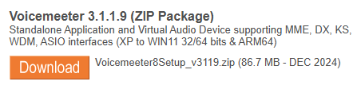
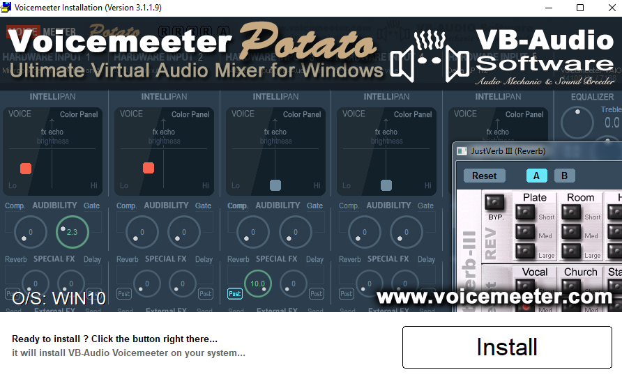
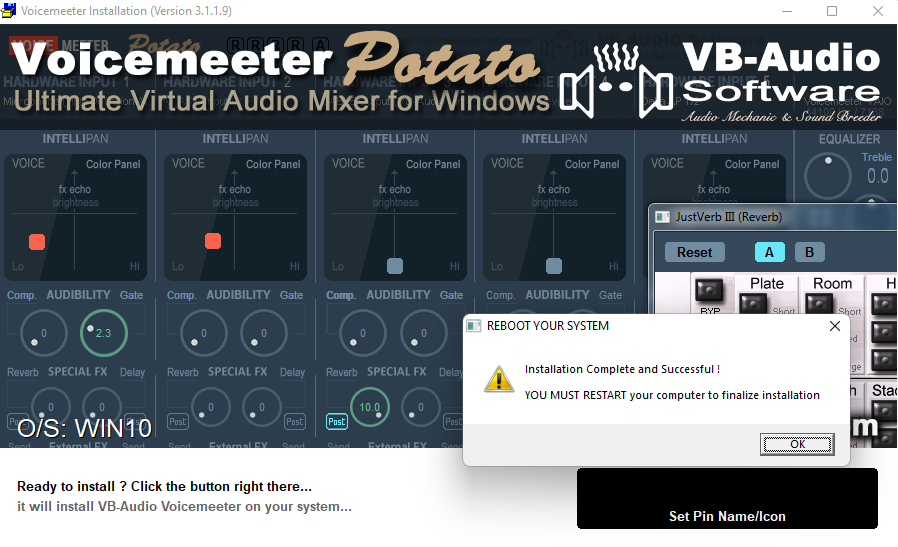
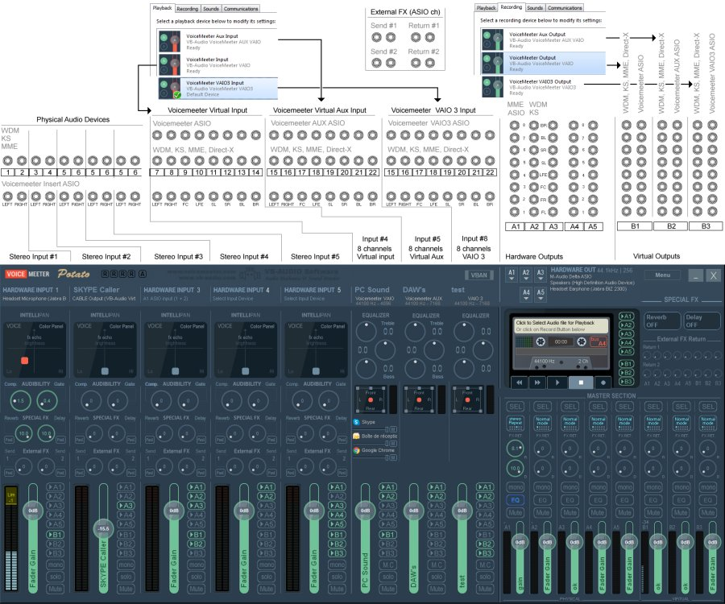
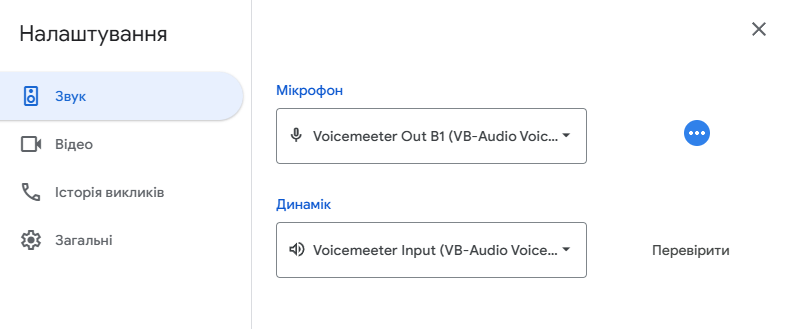
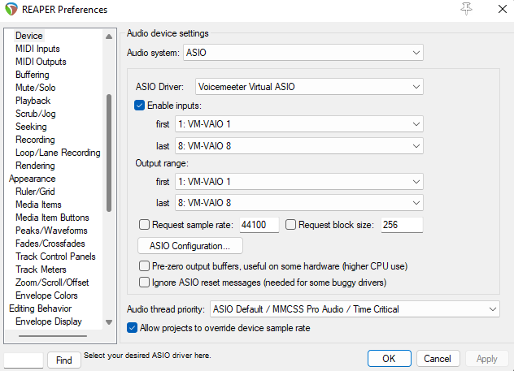

# Посібник з маршрутизації аудіо для музикантів

[ **English**](./README.md)

## Вступ

Цей документ надає інструкції з маршрутизації аудіо пристроїв на Windows PC. Він призначений для музикантів, які потребують підключення гітари та мікрофона через програмне забезпечення ефектів до моніторних колонок та додатків для відеозв'язку, що корисно для онлайн-уроків, запису та прямих трансляцій.

## Зміст
- [Посібник з маршрутизації аудіо для музикантів](#посібник-з-маршрутизації-аудіо-для-музикантів)
  - [Вступ](#вступ)
  - [Зміст](#зміст)
  - [Необхідні компоненти](#необхідні-компоненти)
  - [Апаратний аудіо інтерфейс](#апаратний-аудіо-інтерфейс)
    - [Роль апаратного аудіо інтерфейсу](#роль-апаратного-аудіо-інтерфейсу)
    - [Існує кілька поширених типів апаратних аудіо інтерфейсів:](#існує-кілька-поширених-типів-апаратних-аудіо-інтерфейсів)
    - [Архітектура входів/виходів аудіо інтерфейсу](#архітектура-входіввиходів-аудіо-інтерфейсу)
  - [Програмне забезпечення Voicemeeter](#програмне-забезпечення-voicemeeter)
    - [Налаштування **`Voicemeeter Potato`**](#налаштування-voicemeeter-potato)
    - [Розпочнімо](#розпочнімо)
    - [Секції інтерфейсу додатка Voicemeeter](#секції-інтерфейсу-додатка-voicemeeter)
    - [Розуміння віртуальних входів та системних каналів](#розуміння-віртуальних-входів-та-системних-каналів)
    - [Розуміння віртуальних виходів та системних шин](#розуміння-віртуальних-виходів-та-системних-шин)
      - [Шини A (апаратні виходи)](#шини-a-апаратні-виходи)
      - [Шини B (віртуальні виходи)](#шини-b-віртуальні-виходи)
    - [Загальна схема входів/виходів **`Voicemeeter Potato`**](#загальна-схема-входіввиходів-voicemeeter-potato)
    - [Основні системні налаштування Windows](#основні-системні-налаштування-windows)
      - [Встановіть пристрій виводу (відтворення):](#встановіть-пристрій-виводу-відтворення)
      - [Встановіть пристрій вводу (запис):](#встановіть-пристрій-вводу-запис)
    - [Налаштування стандартних виходу/входу](#налаштування-стандартних-виходувходу)
      - [Налаштування стандартного апаратного виходу](#налаштування-стандартного-апаратного-виходу)
      - [Налаштування апаратних входів](#налаштування-апаратних-входів)
    - [Проста пряма маршрутизація](#проста-пряма-маршрутизація)
    - [Оптимізація буферизації та частоти дискретизації](#оптимізація-буферизації-та-частоти-дискретизації)
    - [Готово! Перевірка базового налаштування](#готово-перевірка-базового-налаштування)
  - [Налаштування додатка для відеозв'язку](#налаштування-додатка-для-відеозвязку)
  - [Розширені схеми маршрутизації](#розширені-схеми-маршрутизації)
    - [Розуміння драйвера **`Voicemeeter Virtual Input ASIO`**](#розуміння-драйвера-voicemeeter-virtual-input-asio)
    - [Маршрутизація через `DAW` / `VSTs`](#маршрутизація-через-daw--vsts)
      - [Навіщо ми це використовуємо?](#навіщо-ми-це-використовуємо)
      - [Увімкнення **`Voicemeeter Virtual Input ASIO`**](#увімкнення-voicemeeter-virtual-input-asio)
      - [Увімкнення Voicemeeter Virtual Insert Return](#увімкнення-voicemeeter-virtual-insert-return)
    - [Схема маршрутизації для бюджетних інтерфейсів](#схема-маршрутизації-для-бюджетних-інтерфейсів)
      - [Огляд маршрутизації](#огляд-маршрутизації)
      - [Апаратний вхід](#апаратний-вхід)
      - [Обробка за допомогою `DAW` / `VSTs`](#обробка-за-допомогою-daw--vsts)
      - [Зворотний шлях](#зворотний-шлях)
      - [Фінальний мікс та вихід](#фінальний-мікс-та-вихід)
    - [Схема маршрутизації для високоякісних інтерфейсів](#схема-маршрутизації-для-високоякісних-інтерфейсів)
    - [Схема кількох аудіо інтерфейсів](#схема-кількох-аудіо-інтерфейсів)

## Необхідні компоненти

* [**Апаратний аудіо інтерфейс**](#апаратний-аудіо-інтерфейс)
  
  Апаратний пристрій, такий як USB або PCI-E звукова карта, або гітарний процесор з USB аудіо драйвером.

* **Мікрофон**

* **Гітара**
* [**Voicemeeter Potato**](#програмне-забезпечення-voicemeeter)
  
  Це програмне забезпечення маршрутизує ваші аудіо апаратні засоби та віртуальні пристрої вводу/виводу. Обов'язково використовуйте версію Potato, оскільки вона включає власний драйвер `Voicemeeter Virtual Input ASIO`. Цей драйвер важливий для маршрутизації звуку через `DAW` або програмне забезпечення, таке як `Guitar Rig` або `Bias FX`.

* **`DAW` / `VSTs`**
  
  `DAW` (Цифрова аудіо робоча станція) використовується для керування апаратними входами та додавання ефектів до ваших аудіо каналів через драйвер `Voicemeeter Virtual Input ASIO`. Залежно від налаштувань, ви можете використовувати плагіни `VST` безпосередньо без повноцінної `DAW`.

* **Додаток для відеозв'язку**
    Будь-який додаток, що дозволяє вибирати аудіо пристрій, наприклад Google Meet, Zoom, Telegram або Discord.

## Апаратний аудіо інтерфейс

### Роль апаратного аудіо інтерфейсу

Апаратний аудіо інтерфейс є важливим зовнішнім пристроєм для будь-якого серйозного аудіо налаштування. Він оснащений власним виділеним **`Центральним аудіо процесором (CAP)`**, який обробляє аудіо незалежно від вбудованої звукової карти вашого комп'ютера.

Основна функція інтерфейсу - забезпечити високоякісні фізичні з'єднання для професійних мікрофонів та інструментів. Він включає різні варіанти входів/виходів, такі як порти XLR для мікрофонів та роз'єми 1/4" (6,5 мм) або 1/8" (3,5 мм) для інструментів, таких як гітари та синтезатори.

Ці інтерфейси підключаються до вашого ПК через USB або PCI-E, а їх виділена обчислювальна потужність є ключовою для **`зменшення затримки входу/виходу аудіо`**. Це критична перевага для музикантів, оскільки дозволяє моніторинг та запис в реальному часі з мінімальною затримкою.

### Існує кілька поширених типів апаратних аудіо інтерфейсів:

* **USB аудіо карта / гітарний процесор з USB інтерфейсом:** Це зовнішні пристрої, які підключаються до комп'ютера через USB кабель.

* **Аудіо карта на материнській платі:** Це інтегрована звукова карта, вбудована безпосередньо в материнську плату вашого комп'ютера.

* **PCI-E аудіо карта:** Звукова карта, що встановлюється внутрішньо в слот PCI-E на вашій материнській платі.

* **Вбудований USB аудіо інтерфейс апаратного синтезатора:** Багато сучасних синтезаторів включають вбудований аудіо інтерфейс, що дозволяє підключити їх безпосередньо до комп'ютера через `USB`.

### Архітектура входів/виходів аудіо інтерфейсу

> [!IMPORTANT]
> Цей розділ є важливим для розуміння основних принципів аудіо маршрутизації. Ретельне розуміння забезпечить успішне налаштування.

Кількість доступних апаратних та програмних входів і виходів аудіо інтерфейсу залежить від його `Центрального аудіо процесора (CAP)`.

* **`Простіші інтерфейси`** зазвичай мають CAP, який призначає один стерео канал (R/L) двом моно апаратним входам. Як наслідок, інтерфейс відображається в вашій операційній системі як один стерео пристрій з двома каналами (R та L). Хоча це функціонально, це може ускладнити процес маршрутизації та налаштування, особливо в системі Windows.

* **`Високоякісні інтерфейси`** використовують більш розширену конструкцію CAP, де кожному апаратному входу призначається власний виділений стерео канал. Це дозволяє системі розпізнавати кожен апаратний вхід як окремий, відмітний інтерфейс, забезпечуючи більшу гнучкість та спрощену маршрутизацію.

Наведена діаграма ілюструє цю різницю.

## Програмне забезпечення Voicemeeter

`Voicemeeter` - це безкоштовний віртуальний аудіо мікшер для `Windows`. Він дозволяє керувати та маршрутизувати аудіо з різних джерел - як апаратних (наприклад, мікрофон або аудіо інтерфейс), так і програмних (наприклад, веб-браузер, відеогра або додаток для відеозв'язку).

По суті, він діє як центральний хаб, де ви можете змішувати всі звуки вашого комп'ютера, застосовувати ефекти, а потім відправляти фінальний мікс на кілька виходів, таких як навушники, колонки або додаток для запису. Це потужний інструмент для музикантів, подкастерів та стрімерів, які потребують більшого контролю над аудіо, ніж забезпечує стандартне налаштування Windows.

### Налаштування **`Voicemeeter Potato`**

> [!Important]
> Важливо завантажити та встановити версію **`Voicemeeter Potato`**. На відміну від стандартного Voicemeeter, версія Potato включає важливий драйвер **`Voicemeeter Virtual Input ASIO`**. Цей драйвер необхідний для маршрутизації аудіо через ваш `DAW` або плагіни `VST` (наприклад, Guitar Rig або Bias FX), що є ключовою частиною налаштування цього посібника.

* **Завантажте Voicemeeter Potato**
  
  [Перейдіть на офіційний сайт](https://vb-audio.com/Voicemeeter/potato.htm) та натисніть помітну помаранчеву кнопку **"Download"**.

  

* **Встановіть програмне забезпечення**
  
  Після завершення завантаження запустіть інсталятор. **Натисніть "Install"** та зачекайте завершення процесу, це може зайняти кілька хвилин

  
  

* **Перезавантажте комп'ютер**

Необхідне перезавантаження системи для завершення встановлення та увімкнення всіх віртуальних аудіо драйверів. Будь ласка, перезавантажте комп'ютер перед продовженням.

### Розпочнімо

Відкрийте **`Пуск`** та запустіть **`Voicemeeter Potato x64`**

### Секції інтерфейсу додатка Voicemeeter

Додаток **`Voicemeeter Potato`** має інтерфейс, розділений на кілька загальних секцій:
* Апаратні входи
* Програмні віртуальні входи
* Селектор апаратних виходів
* Головна секція
  * Апаратні виходи
  * Програмні віртуальні виходи

### Розуміння віртуальних входів та системних каналів

У **`Voicemeeter Potato`** віртуальні пристрої, які ви вибираєте в Windows для відтворення, безпосередньо відповідають вхідним каналам мікшера. Так ви маршрутизуєте звук з програмних додатків у Voicemeeter.

* **Апаратні входи (фізичні пристрої)**
  
  Ці канали призначені для отримання аудіо від зовнішнього обладнання, підключеного до вашого ПК (наприклад, ваш аудіо інтерфейс, USB мікрофон тощо).

* **Апаратний вхід 1-5**

  Ви призначаєте ці канали фізичному пристрою в меню **`Select Input Device`**. Наприклад, ви вибрали б тут свій аудіо інтерфейс для отримання сигналів гітари та мікрофона.

* **Віртуальні входи (програмні додатки)**
  
  Ці канали призначені для отримання аудіо безпосередньо від програмного забезпечення на вашому комп'ютері.

* **Voicemeeter VAIO**
  
  Це основний віртуальний вхідний канал. Ви можете встановити його як стандартний пристрій відтворення в налаштуваннях звуку Windows. Будь-який додаток, що використовує стандартний пристрій відтворення (як веб-браузер або медіаплеєр), матиме своє аудіо маршрутизоване до цього каналу.

* **Voicemeeter AUX VAIO**

  Це вторинний віртуальний вхід. Ви можете призначити конкретні додатки для використання цього каналу, що дозволяє контролювати їх рівні аудіо незалежно в мікшері Voicemeeter.

* **Voicemeeter VAIO3**
  
  Третій віртуальний вхід у версії Potato, що пропонує ще більшу гнучкість для маршрутизації аудіо від третього додатка.

> [!Note]
> Кожен з цих віртуальних входів з'являється як окремий пристрій відтворення в налаштуваннях звуку Windows. Вибираючи, яка програма використовує який віртуальний вхід, ви можете змішувати та контролювати всі аудіо джерела вашого комп'ютера з одного центрального місця.

### Розуміння віртуальних виходів та системних шин

У **`Voicemeeter Potato`** віртуальні пристрої, які ви бачите в Windows, безпосередньо відповідають вихідним шинам мікшера. Це основний принцип аудіо маршрутизації.

#### Шини A (апаратні виходи)
Вони призначені для надсилання вашого аудіо на фізичні пристрої, підключені до комп'ютера.

* **A1** - Це основна апаратна шина. Ви можете призначити її своїм навушникам або студійним моніторам, наприклад.
* **A2** - Друга апаратна шина, яку ви можете використовувати для додаткових моніторів або іншого обладнання.
* ...і так далі, до **A5**.

#### Шини B (віртуальні виходи)
Вони призначені для надсилання вашого змішаного аудіо сигналу назад у систему для використання іншими додатками (відеочати, програми запису тощо).

* **B1** - Основна віртуальна шина. Цей канал зазвичай використовується як "віртуальний мікрофон" у додатках як Discord, Zoom та OBS. Все, що ви надсилаєте на шину `B1`, буде почуто в цих додатках.
* **B2** - Друга віртуальна шина, яку можна використовувати для додаткового аудіо потоку, такого як окрема доріжка для програм запису або виділений потік для конкретного додатка.
* **B3** - Третя віртуальна шина.

> [!Note]
> Кожен канал у вашому мікшері Voicemeeter має кнопки для `A1-A5` та `B1-B3`. Натискаючи їх, ви вирішуєте, куди маршрутизувати аудіо з конкретного каналу. Наприклад, якщо ви увімкнете `A1` на каналі гітари, ви почуєте його у навушниках. Якщо увімкнете `B1`, це буде почуто у вашому відеочаті.

### Загальна схема входів/виходів **`Voicemeeter Potato`**

### Основні системні налаштування Windows

#### Встановіть пристрій виводу (відтворення):

* Перейдіть до налаштувань звуку Windows.
* У розділі "Вивід" виберіть `Voicemeeter Input` як головний або стандартний пристрій.

  

Чому? Це повідомляє вашій системі надсилати все аудіо з веб-браузера, ігор, системних сповіщень та інших додатків безпосередньо в Voicemeeter. Цей аудіо потік з'явиться на віртуальному вході `Voicemeeter Input` у вашому мікшері.

#### Встановіть пристрій вводу (запис):

* У тому ж вікні налаштувань звуку Windows перейдіть до розділу "Ввід".
* Виберіть Voicemeeter Output як головний або стандартний пристрій.

  

Чому? Цей пристрій відповідає основній віртуальній шині, `B1`, у `Voicemeeter`. Коли ви вибираєте його як мікрофон у додатку для відеочату як Discord або Zoom, цей додаток отримає весь аудіо мікс, який ви надсилаєте на шину `B1` - це може бути ваш мікрофон, ваша гітара та будь-які інші звуки, які ви туди маршрутизували.

### Налаштування стандартних виходу/входу

#### Налаштування стандартного апаратного виходу
Тепер, коли ви маршрутизували все системне аудіо в Voicemeeter, вам потрібно маршрутизувати його назад до ваших фізичних колонок або навушників, щоб ви могли його почути.

* **Виберіть апаратний вихід** 
  
  У верхній правій секції інтерфейсу Voicemeeter ви побачите панель з назвою "Hardware Out". Натисніть кнопку `A1`.

  

* **Виберіть пристрій**
  
  З випадаючого меню, що з'явиться, виберіть бажаний пристрій прослуховування. Зазвичай це ваші навушники, студійні монітори або фізичний вихід на вашому аудіо інтерфейсі (наприклад, ваш Behringer, Scarlett 2i2 або подібний).

  

Виконавши цей крок, будь-яке аудіо, яке ви надсилаєте на шину `A1` у Voicemeeter, буде маршрутизовано до вибраного апаратного пристрою, дозволяючи вам чути ваші інструменти, мікрофон та інші системні звуки.

#### Налаштування апаратних входів
Voicemeeter може приймати аудіо від п'яти окремих апаратних пристроїв. Тут ви підключаєте свій аудіо інтерфейс, USB мікрофон або будь-який інший фізичний вхідний пристрій.

* **Знайдіть смужки апаратних входів**
  
  У лівій частині інтерфейсу Voicemeeter ви побачите серію вертикальних смужок каналів з назвами Stereo Input 1, Stereo Input 2 тощо.

* **Виберіть перший пристрій** 
  
  Натисніть кнопку **`Select Input Device`** у верхній частині першої смужки каналу, яку ви хочете використовувати.
  
  

* **Виберіть аудіо інтерфейс** 
  
  З випадаючого меню виберіть ваш аудіо інтерфейс. Краще вибирати драйвер ASIO для вашого пристрою, якщо він доступний, оскільки він забезпечує найнижчу затримку.

  

* **Додайте більше пристроїв** 
  
  Якщо у вас є кілька пристроїв - наприклад, окремий USB мікрофон або MIDI контролер з аудіо входом - повторіть процес для інших смужок апаратних входів.

Роблячи це, ви кажете Voicemeeter слухати ваші фізичні пристрої. Тепер ви можете використовувати фейдери та кнопки на цих каналах для змішування та маршрутизації аудіо від гітари та мікрофона до вихідних шин.

### Проста пряма маршрутизація

Після вибору входів і виходів маршрутизація аудіо виконується лише кількома кліками. Мета - надіслати ваші звуки до правильних вихідних шин: `A1` (щоб ви могли їх почути) та `B1` (щоб ваша аудиторія могла їх почути).

Проста схема маршрутизації, пояснення якої ви можете знайти нижче.

* **Для мікрофона та гітари**
  * Знайдіть канали, що відповідають вашому мікрофону та гітарі в секції апаратних входів.
  * Для кожного каналу натисніть кнопку `A1`. Це надсилає ваш звук на вихід `A1`, дозволяючи вам моніторити себе через навушники.
  * Далі натисніть кнопку `B1` на кожному каналі. Це надсилає ваш звук на вихід `B1`, який буде підхоплений вашим додатком для відеочату.

* **Для системних звуків**
  * Знайдіть канал Voicemeeter VAIO в секції віртуальних входів.
  * Натисніть кнопку `A1`. Це надсилає всі системні звуки (аудіо браузера, звуки ігор тощо) до ваших навушників, щоб ви могли їх почути.
  * Якщо ви хочете, щоб інші у вашому відеочаті чули ваші системні звуки, ви також можете натиснути кнопку `B1` на цьому каналі.

* **Остаточна перевірка**
  * Переконайтеся, що ви можете бачити сигнал на фейдері для мікрофона та гітари.
  * Підтвердьте, що кнопки `A1` та `B1` підсвічуються на каналах, які ви хочете маршрутизувати.
  * Це просте налаштування маршрутизує всі основні аудіо джерела як до вас (через `A1`), так і до вашої аудиторії (через `B1`), створюючи повний та збалансований мікс.

### Оптимізація буферизації та частоти дискретизації
> [!Important]
> Правильне налаштування розміру буфера є важливим для мінімізації затримки між вашим інструментом та колонками.

* Відкрийте додаток **`Voicemeeter Potato`** та натисніть кнопку **`Menu`** у верхньому правому куті.
* З випадаючого меню виберіть опцію `System Settings`.
* У вікні налаштувань знайдіть секцію `Buffering` та встановіть розмір буфера на `256` для обох типів драйверів:
  * `WDM (Wave Device)`: Стандартний драйвер Windows.
  * `ASIO`: Низькозатримковий драйвер, що використовується для професійного аудіо.

> [!NOTE]
> Ви можете експериментувати зі зменшенням розміру буфера до `160` або навіть менше, якщо потрібно. Однак дуже низька буферизація може спричинити аудіо артефакти (тріскотіння, випадіння), якщо ваш процесор не може обробляти аудіо досить швидко. Оптимальне значення залежить від продуктивності вашого комп'ютера.

### Готово! Перевірка базового налаштування

Все готово! На цьому етапі ваше основне налаштування має бути завершене. Тепер ви можете протестувати своє аудіо, щоб переконатися, що все працює як очікується.

* Ви повинні мати можливість почути наступне через ваші навушники або монітори:
* Всі системні звуки (з вашого браузера, додатка для відеочату, ігор тощо)
* Ваш мікрофон
* Вашу гітару
* Ви також повинні мати можливість використовувати Voicemeeter Output як мікрофон в інших додатках (як Discord або Zoom).

> [!Tip]
> Якщо вам не потрібна розширена аудіо маршрутизація через `DAW` або плагіни `VSTs`, ваше налаштування тепер завершене.
Ви можете перейти до розділу [Налаштування додатка для відеозв'язку](#налаштування-додатка-для-відеозвязку).

## Налаштування додатка для відеозв'язку

* Відкрийте ваш додаток для відеозв'язку (наприклад, Discord, Zoom, Google Meet).
* Перейдіть до налаштувань аудіо або розділу голос та відео.
* Для налаштування `Мікрофон` або пристрій вводу виберіть `Voicemeeter Out B1`.
* Для налаштування `Колонки` або пристрій виводу виберіть `Voicemeeter Input`.

## Розширені схеми маршрутизації

### Розуміння драйвера **`Voicemeeter Virtual Input ASIO`**

Драйвер Voicemeeter Virtual Input ASIO є ключовою функцією версії Voicemeeter Potato. Він створює виділене, низькозатримкове аудіо з'єднання між вашим мікшером Voicemeeter та іншим професійним аудіо програмним забезпеченням.

**Що це таке**

Спеціалізований віртуальний вхід, що функціонує з використанням протоколу ASIO. На відміну від стандартних драйверів WDM, ASIO призначений для професійних аудіо додатків та мінімізує затримку між моментом створення звуку та моментом його обробки.

**Для чого це потрібно**

Цей драйвер є важливим для інтеграції цифрової аудіо робочої станції (`DAW`) або окремих плагінів `VST` (як Guitar Rig або Bias FX) у ваше налаштування Voicemeeter. Вибравши цей драйвер у вашій `DAW`, ви можете надіслати своє аудіо (наприклад, сигнал гітари) через програмне забезпечення ефектів, а потім назад у Voicemeeter, все з мінімальною затримкою.

Коротко кажучи, це міст, який дозволяє використовувати ваше улюблене програмне забезпечення ефектів та професійні аудіо інструменти в реальному часі в рамках вашого робочого процесу Voicemeeter.

### Маршрутизація через `DAW` / `VSTs`

#### Навіщо ми це використовуємо?

Маршрутизація вашого аудіо через цифрову аудіо робочу станцію (`DAW`) або хост `VST` є ключем до досягнення професійної якості звуку для вашого інструменту. Цей процес дозволяє додавати потужні ефекти, такі як спотворення, емуляція кабінету, реверберація та еквалайзер до вашої гітари або мікрофона в реальному часі. Це те, що робить просте домашнє налаштування схожим на професійну студію, що ідеально підходить для онлайн уроків, стрімінгу та запису.

#### Увімкнення **`Voicemeeter Virtual Input ASIO`**
Для надсилання вашого аудіо в `DAW` або хост `VST`, вам потрібно використовувати спеціалізований драйвер **`Voicemeeter Virtual Input ASIO`**. Цей драйвер забезпечує низькозатримкове з'єднання, необхідне для обробки в реальному часі.

* Відкрийте вашу `DAW` (наприклад, `Ableton`, `FL Studio`) або ваш додаток хост `VST` (наприклад, Guitar Rig, Bias FX).
* Перейдіть до меню налаштувань аудіо або параметрів.
* У налаштуваннях пристрою вводу або драйвера виберіть **`Voicemeeter Virtual Input ASIO`**. Це повідомляє вашому програмному забезпеченню отримувати аудіо від Voicemeeter.
* У вашому програмному забезпеченні переконайтеся, що вхід каналу вашого інструменту налаштований на отримання аудіо від лівого або правого каналу драйвера **`Voicemeeter Virtual Input ASIO`**.

  Нижче надані приклади налаштуваннь для деяких `DAW`:

  **FL Studio Audio Settings**

  

  **Reaper Device Preferences**

  

#### Увімкнення Voicemeeter Virtual Insert Return
Після обробки вашого аудіо ефектами в `DAW` або хості `VST`, вам потрібно надіслати його назад у Voicemeeter для фінального міксу.

* У вашій `DAW` або хості `VST` поверніться до налаштувань аудіо.

* Встановіть пристрій виводу або драйвер на `Voicemeeter VAIO` або інший віртуальний вхід, який ви хочете використовувати.

Ваше оброблене аудіо тепер з'явиться на відповідному каналі віртуального входу у вашому мікшері Voicemeeter. Тепер ви можете змішувати цей новий, оброблений сигнал з іншими аудіо джерелами та маршрутизувати його до навушників (`A1`) та відеочату (`B1`).

### Схема маршрутизації для бюджетних інтерфейсів
Ця діаграма ілюструє детальне налаштування аудіо маршрутизації для бюджетних аудіо інтерфейсів, які поєднують два фізичні моно входи (наприклад, мікрофон та гітару) в один стерео канал. Ця конфігурація є важливою для музикантів, які потребують обробки своїх інструментів ефектами в реальному часі.

#### Огляд маршрутизації

#### Апаратний вхід
Аудіо від вашого мікрофона та гітари захоплюється інтерфейсом та надсилається до вашого ПК як один стерео вхід. Цей вхід потім призначається каналу апаратного входу в Voicemeeter.

#### Обробка за допомогою `DAW` / `VSTs`
Для додавання ефектів аудіо маршрутизується від Voicemeeter до `DAW` або хоста `VST` (як Guitar Rig). Це важливий крок, який використовує драйвер Voicemeeter Virtual Input ASIO для забезпечення низькозатримкового з'єднання.

#### Зворотний шлях
Оброблене аудіо, тепер з ефектами (наприклад, спотворення, реверберація), надсилається назад від `DAW` / `VST` до каналу віртуального входу в Voicemeeter.

#### Фінальний мікс та вихід
Після повернення обробленого аудіо в Voicemeeter воно маршрутизується до двох основних вихідних шин:

* **A1 (Апаратний вихід):** Ця шина надсилає фінальний мікс до ваших фізичних навушників або моніторів, дозволяючи вам чути себе та всі системні звуки.

* **B1 (Віртуальний вихід):** Ця шина надсилає фінальний мікс до вашого додатка для відеочату (Google Meet, Zoom тощо), дозволяючи вашій аудиторії чути ваш оброблений звук.

Ця повна схема показує, як обійти обмеження простого аудіо інтерфейсу для досягнення професійної низькозатримкової аудіо обробки для онлайн уроків, стрімінгу та запису.

### Схема маршрутизації для високоякісних інтерфейсів

Допрацьовуємо...

<!-- #### Огляд маршрутизації-1
Діаграма ілюструює комплексний потік аудіо сигналу, починаючи від апаратних входів, маршрутизуючи через цифрову аудіо робочу станцію (`DAW`) та плагіни віртуальної студійної технології (`VST`) для обробки, та зрештою виводячи на навушники або монітори. Ключовою особливістю є використання двох окремих стерео апаратних входів, що дозволяє одночасний запис кількох стерео джерел, таких як синтезатори, з подальшою їх незалежною обробкою в `DAW`.

#### Апаратний вхід-1
Налаштування починається з двох окремих стерео входів в аудіо інтерфейс, такий як Focusrite Scarlett 4i4. Діаграма позначає їх як "Hardware Stereo Input 1 (L/R)" та "Hardware Stereo Input 2 (L/R)."

* **Вхід 1:** Стерео сигнал від джерела, такого як апаратний синтезатор, підключається до цієї пари входів.
* **Вхід 2:** Інше стерео джерело, можливо драм-машина або другий синтезатор, підключається тут.
Аудіо інтерфейс надсилає ці два різні стерео сигнали до `DAW`, де вони отримуються на двох окремих стерео каналах, позначених як "Hardware Input 1" та "Hardware Input 2."

#### Обробка за допомогою `DAW` / `VSTs`-1
Після потрапляння в `DAW` сигнали обробляються незалежно. Діаграма показує сигнал від кожного апаратного входу, що надсилається до виділеного каналу мікшера в `DAW`.

* **Канал мікшера 1:** Сигнал від апаратного входу 1 маршрутизується сюди. Потім він обробляється ланцюжком плагінів `VST`, включаючи еквалайзер, компресор та реверберацію. Діаграма також показує плагін `Voicemeeter`, що припускає специфічну обробку вокалу, яка може бути емуляцією або іншим типом канальної смужки. Оброблене аудіо потім надсилається до "Voicemeeter path Left/Right."

* **Канал мікшера 2:** Сигнал від апаратного входу 2 маршрутизується сюди та обробляється різним набором плагінів VST, включаючи еквалайзер, компресор та "Cabinet simulation," що вказує на те, що цей канал імовірно для гітари або бас-сигналу. Це оброблене аудіо також надсилається до "Voicemeeter path Left/Right."
Використання двох окремих каналів та незалежних ланцюжків плагінів дозволяє детальний контроль та специфічний звуковий дизайн для кожного джерела. Діаграма також показує вихід `DAW`, що маршрутизується до дзвінка Google Meet/Zoom, вказуючи, що це налаштування можна використовувати для стрімінгу або онлайн співпраці.

#### Зворотний шлях-1
Оброблене аудіо від `DAW` потрібно надіслати назад до користувача для прослуховування. Ось де вступає зворотний шлях. "Final Mix" від головного виходу DAW надсилається назад до аудіо інтерфейсу. Діаграма позначає це як "Hardware Stereo Output (L/R)."

#### Фінальний мікс та вихід-1
Фінальний мікс, тепер з усією застосованою обробкою, надсилається від `DAW` до аудіо інтерфейсу. Аудіо інтерфейс потім маршрутизує цей сигнал до фінальних пристроїв прослуховування:

* **Навушники:** Оброблене аудіо надсилається до роз'єму навушників на аудіо інтерфейсі.

* **Монітори:** Сигнал також надсилається до студійних моніторів для ширшої перспективи прослуховування.
Ця конфігурація ідеальна для низькозатримкового моніторингу, оскільки оброблене аудіо маршрутизується безпосередньо назад до навушників та моніторів від аудіо інтерфейсу, обходячи будь-який програмний моніторинг, який міг би внести затримку. Це поширене налаштування для професійного музичного виробництва та живого стрімінгу, де мінімальна затримка є критичною.

Ця повна схема показує, як налаштувати Voicemeeter та `DAW` для досягнення професійної низькозатримкової аудіо обробки для онлайн уроків, стрімінгу та запису. -->

### Схема кількох аудіо інтерфейсів
Незабаром...